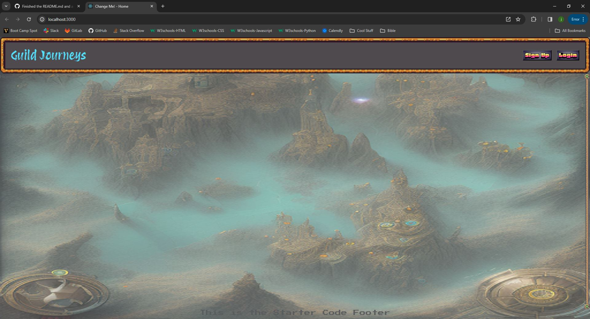

# guild_journeys
We want to create an RPG website for game masters and players.

## Description

 - We want to create an RPG website for game masters and players.

## Table of Contents

  - [Credits](#credits)
  - [Badges](#badges)
  - [Features](#features)
  - [Questions](#questions)
  - [Screenshot](#screenshot)
  - [DeployedApp](#deployedApp)

## Credits

 - This website was coded by Dakota Johnson, Julie Bowers, and Katoria McMullen.

 - # project-3-starter-code

 - Instructor Caleb Crum helped us with various things during the project. [Caleb's GitHub account](https://github.com/CalebCrumInstructor)

 - TA Ethan Dodgen helped us with various things during the project too. [Ethan's GitHub account](https://github.com/thefival)

 - Dakota's brother (boot camp graduate) helped him out with technical things like turning in the assignment or pushing to the repo correctly. [Dylan's GitHub account](https://github.com/dylanstormjohnson)

## Badges

 - HTML
 - CSS
 - JavaScript

## Features

 - When a user upload a Campaign,...
 - Then the user can view the Campaign again from their account.
 - When a user uploads a Player Sheet,...
 - Then the user can view the Player Sheet again from their account.
 - If the user looks at this third feature in the README.md, he or she has found this project's Easter Egg.  Good job (and sorry for the lazy Easter Egg)!

## Questions

 - If you have any questions for me, my GitHub account is [Dakota's GitHub account](https://github.com/josephdakotajohnson).

## Screenshot

 - This is a screenshot of the application: .

## DeployedApp

 - This is a link to the fully deployed application: (https://josephdakotajohnson.github.io/guild_journeys/).
